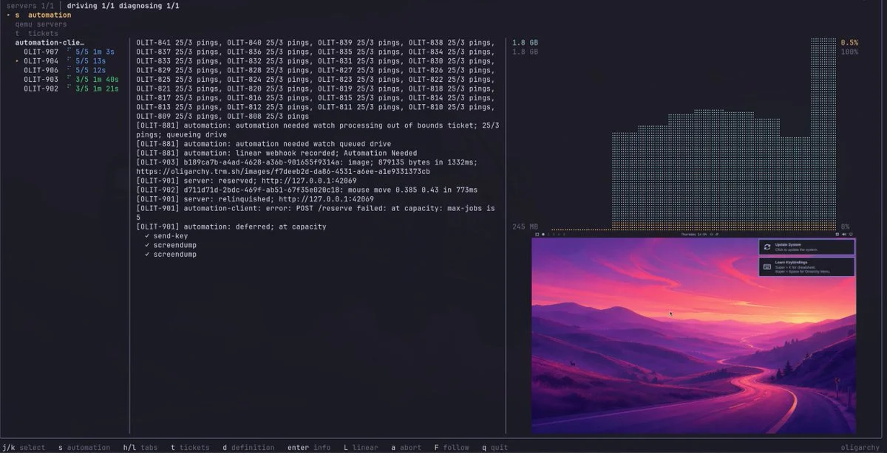

[ThePrimeagen](https://x.com/ThePrimeagen) is joining [Omarchy Core](/teams/) to lead **Agentic QA**! The man who made Vim, the terminal, and Linux look like the most fun you could have with a computer will now be in charge of making sure every Omarchy release has had a swarm of agents check everything.

This one is coming full circle for me. It was Prime who got me onto Neovim, after spending twenty years with TextMate. And his keyboard-focused Linux setup was a huge inspiration for Omarchy in general. His [Vim tutorials](https://www.youtube.com/watch?v=X6AR2RMB5tE&list=PLm323Lc7iSW_wuxqmKx_xxNtJC_hJbQ7R) are still an excellent entry point for anyone wanting to learn Omarchy's default editor.

And he's not arriving empty-handed. Over the past month, Prime has been building [Oligarchy](https://github.com/ThePrimeagen/Oligarchy), a custom agent harness that boots Omarchy in QEMU virtual machines and lets agents drive them just like a person would. They send keystrokes, move and click the mouse, take screenshots, and record whether things did what they were supposed to. Each test is a ticket that boots from a freshly minted disk, and a fleet of automation clients picks up the work and reports back. He's been [diagnosing the harness live](https://x.com/ThePrimeagen/status/2095531438288384376) and inviting his interns to come "Brownbaggin, Teabaggin, Lunabaggin, Frodobaggins this AGI" [with him](https://x.com/ThePrimeagen/status/2095670607702589747). Naturally.

This is exactly what an agentic OS needs. Omarchy will be shipping across x86, [Apple hardware](/news/2026/09/introducing-omarchy-m/), [Snapdragon](/news/2026/09/introducing-omarchy-dragon/), Nvidia, Pi, and any other platform we can get our hands on, with thousands of plugins, endless themes, and a growing suite of native applications. No human QA team could click through all of that for every release. But a fleet of agents running on [the DigitalOcean Droplets that power our pipeline](/news/2026/09/digitalocean-joins-as-founding-corporate-patron/) can. They can walk through the installer, update the system, try the keybindings, open the menus, and flag what broke long before you ever see it.

Leading Agentic QA means turning Oligarchy from a fun experiment into a routine part of how we build, test, and ship Omarchy.

Welcome to Omarchy Core, Prime! You helped get me here. Now let's go make it bulletproof.
